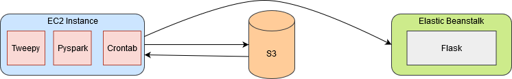

### Twitter Trends 
In this day and age, social media platforms like twitter, facebook, instagram and more have troves of data waiting to be analyzed. In this project, I used twitter data. There is data in many forms that can be analyzed such as what users are tweeting from a specific country, what is the most common device being tweeted from and what are the current trends to name a few. I decided to make a simple application which displays the top ten hashtags for that day. To do this, I had to sign up on twitter to get the access tokens and consumer secrets. Twitter is currently still rolling out their v2.0 I decided to use v1.1 for my application.

Doing some maintenance on the EC2 instance so it will not refresh and show the current results. The results refresh every 6 hours.

### Objectives

*   Devise a method to filter messages based on "#"
*   Create a pipeline to set up streaming between ec2 -> s3 -> elasticbeanstalk.
*   Produce a real time dashboard which shows what is trending.

### Libraries

Some of the tools required to make this project work:

*   [Tweepy](https://tweepy.readthedocs.io/en/latest/getting_started.html) - Twitter streaming API which allows for tweet manipulation, which location to get the tweets from and more.
*   [Pyspark](https://github.com/apache/spark) - A python version of Apache Spark that allows for handling of streaming data and performing analytics.
*   [Hadoop](https://hadoop.apache.org/) - Hadoop is another big data tool that can be used for analytics or for storing data.
*   [Winutils](https://github.com/steveloughran/winutils) - Contains hadoop libraries to run effectively on windows.
*   [Chart.js](https://www.chartjs.org/) - Minimalistic javascript charting application to plot nice charts with minimal code.
*   [Flask](https://flask.palletsprojects.com/en/1.1.x/) - Allows the development of a web application which can be accessed publicly.
*   [AWS CLI](https://aws.amazon.com/cli/) - Helps to communicate with AWS products such as s3, ec2, elasticbeanstalk and more.
*   [Socket](https://docs.python.org/3/library/socket.html) - Utilized to easily connect two nodes to communicate.
*   [Cron](https://man7.org/linux/man-pages/man5/crontab.5.html) - A linux / UNIX tool used for scheduling jobs. Files such as crontab contains instructions to for cron to execute.

### Method

Tweepy streamlistener class was used to set up the streaming process. There were some additional commands added to get the extended tweet text and filter based on language which were added. A local socket was created to start the streaming on the EC2 instance. I decided to use spark streaming rather than structured streaming since we are not building an ideal application and due to AWS free tier restrictions. Furthermore, spark sets up a DStream using sockettextstream to fetch the tweepy streaming data for further processing. In spark, we split the data based on lines and filter with respect to number of hashtags. This is done using the rdd and sql_context. The processed data is then sent as a .csv to be stored in s3 for the specific day and streamed to the flask instance running on elastic beanstalk. Finally, cron is used to automate script running every 6 hours, cleaning up residual checkpoints made by spark (if any) and moving .csv files to s3.

### Block Diagram

### Improvements

Ideally, we can use kafka or amazon kinesis to help facilitate streaming the data, spark structured stream for processing on multiple clusters and storing the data in one of Amazons databases.
